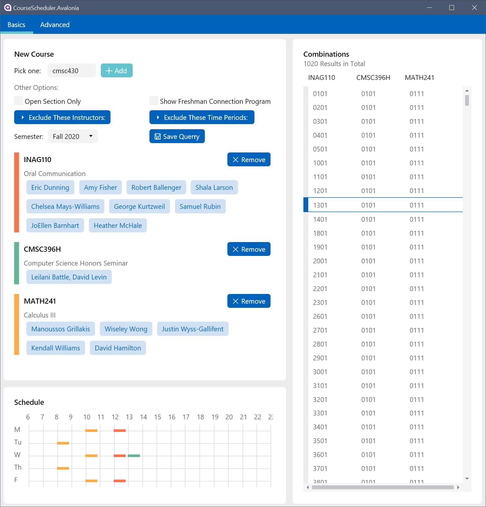

# Course Scheduler 3.0

> This is the latest version of Course Scheduler. For more information on the legacy *Windows* edition, please switch the git branch to *Archive*

This is an application made by a terp, and for all terps. 

## Screenshot:

## How is it different from the well-known Courseoff?

Courseoff is a powerful platform for acquiring some essential information when selecting courses. 
However, this application offers more customized experience. 

### Features

(that courseoff cannot provide)

> Current version is still in developing, some of the features are reimplementation of the ones from *Course Scheduler 2.0* ,and may have tons of bugs. 
>
> More features are incoming. 

- [x] Filter out less preferred professors/instructors. 
- [x] Exclude less favorable time period such as 8 o'clock in a freezing winter morning. 
- [x] Hiding *Freshman Connection Program* related information. 
- [x] Enumerate all possible combinations with the current course configuration. 
- [x] Peek on the number of open seats and wait lists for a given section. 
- [X] Save your course list without the need of logging into any account (Half-completed)

And in addition, since all of the data are crawled from Testudo, it gets updated really fast. 

### Drawbacks

- ~~Apparently, it is a Windows application so it cannot run on your mobile phone, nor Macbook~~ **Not any more**

- Also, there is no any *sign in* or *Share* button so you cannot compare the schedule with your friend directly. 

## Installation

> **The following are all about legacy version**

**Download Address:** [Terp Connect](https://terpconnect.umd.edu/~yishanzh/Course%20Selection%20Software/publish.htm) 

You can download and install the application directly from the webpage. 

> **IMPORTANT**
>
> As you may notice that your Windows is trying to stop you by popping up a warning dialog. This is because that a piece of published software needs to have a legit certificate to show that it's not malware. 
>
> However, this certificate **requires fund** (and a lot! ) which is something that I lack of, so... 
>
> If you are still feeling suspicious, feel free to have a look on the source codes, and compile them manually. 
>
> By clicking the *More Info* button (or something like that), a button will be revealed. Click the install button to continue installing. 

If the progress bar for installation is moving slowly, it may be downloading some dependencies such as *.NET library*. It is possibly because your computer is running an old version of Windows or you actively rejected many Windows update patches. 

> Note: 
> 
> All of the course information is retrieved from Testudo webpage, and therefore it would be temporarily unavailable when Testudo is down or under maintenance. 

**Lastly,**

Since this application uses *ClickOnce* to distribute and deploy, it will automatically check for update every time when it is launched. It is normal for this process to take a few seconds. 

## Some thoughts

This application is developed in my leisure time, so I didn't spent much time in debugging. As a result, if you find any, please see the section below:

## Feedbacks

Feel free to give any advise or feedbacks. Although I might (definitely) not have enough time for tracing every bug, I will still try to locate and exterminate critical ones. 

It would be even nicer of you could try to offer me some clues for a specific bug, or even help me to improve the codes!

## Dependencies

Some projects are imported in the form of source codes, and were modified and customized accordingly. They are: 

- [`Avalonia.ProgressRing`](https://github.com/Deadpikle/AvaloniaProgressRing)
- [`Citrus.Avalonia`](https://github.com/worldbeater/Citrus.Avalonia)

