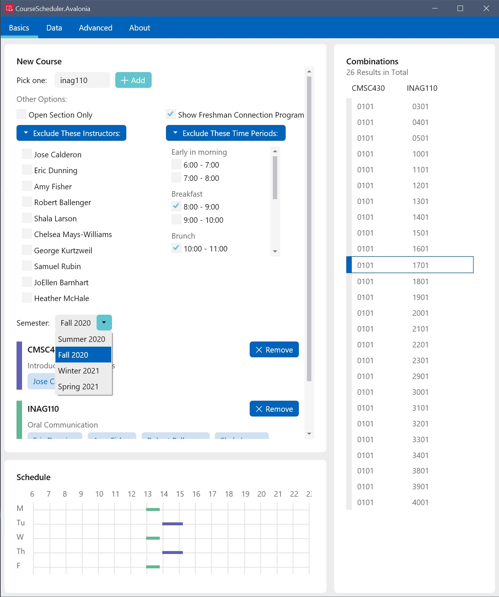
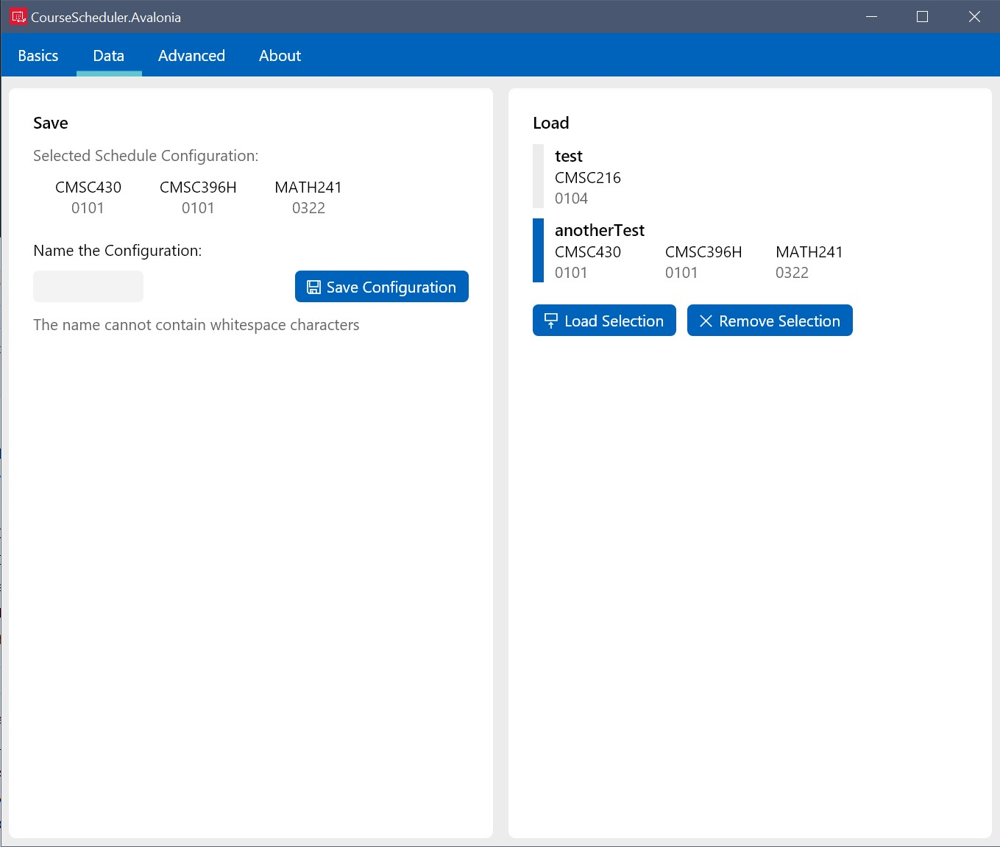

# Course Scheduler 3.0

> This is the latest version of Course Scheduler. For more information on the legacy *Windows* edition, please switch the git branch to *Archive*

This application is made by a terp, and for all terps. Available on *Windows*, *Mac OS* and *Linux*. 

> **Note:** the CLI alternative for *Linux* is still under development. 

## Screenshot:

## How is it different from the well-known Courseoff?

Courseoff is a powerful platform for acquiring some essential information when scheduling courses. 
However, this application offers more customized experience. 

This app is specialized in monitoring the status of planned courses right before registration, and helping you update your best configuration accordingly. 

> For example, your schedule that was planned on *Courseoff* may become unavailable right before the registration date. It would be extremely tedious to find another perfect schedule. *Course Scheduler* helps speed up this process by offering all of the available schedules (combinations of sections) at once and allows you to pick your favorite. 

### Features

(that courseoff cannot provide)

> Current version is still in development, some of the features are reimplementation of the ones from *Course Scheduler 2.0* ,and may have tons of bugs. 
>
> More features are coming. 

- [x] Filter out less preferred professors/instructors. 
- [x] Exclude less preferable time period such as 8 o'clock in a freezing winter morning. 
- [x] Hide *Freshman Connection Program* related information. 
- [x] Enumerate all possible combinations with the current course configuration. 
- [x] Peek on the number of open seats and wait lists for a given section. 
- [X] Save your course list without the need of logging into any account

In addition, since all of the data are crawled from Testudo, it gets updated really fast. 

### Drawbacks

- It is a desktop app, and therefore cannot run on phones. 
- Also, there is no any *sign in* or *Share* button so you cannot compare the schedule with your friend directly. 
- All of the course information is retrieved from Testudo webpage, and therefore it would be temporarily unavailable when Testudo is down or under maintenance. 

## Then, how is it different from Venus? 

> Venus is also a course builder. You can access it directly from [Testudo](http://www.sis.umd.edu/bin/venus). 

- [x] Apparently, its UI is way more intuitive. 
- [x] Filter out less preferred professors/instructors. 
- [x] Easier to use
- [x] CLI support (incoming)

## How-to

### The *Basics* Page

To add a course, simply type in the course name and click *Add*. The course name can be in lower-case. 

> **Note:** There are no suggestions when typing in course names, so make sure you remember the names correctly :D

Sometimes, there are just too many available schedules to choose. You can apply some filters to limit the results. 

### The *Data* Page

The left panel is for saving your current selection. 

> **Note:** It will not save the filter. 

1. Click on a combination of sections in *Basics* page and you will see it in *Selected Schedule Configuration*. 
2. Give the configuration a name. There should not be any spaces in the name. 
3. Save it. 

The right panel is for loading the saved configurations. 

1. Click an item. 
2. Load it. 
3. Go back to *Basics* page, and you will find the highlighted schedule. 

### The *Advanced* Page

Please just ignore it for now. 

## Some thoughts

This application is developed in my leisure time, so I didn't spent much time in debugging. As a result, if you find any, please see the section below:

## Feedbacks

Feel free to give any advise or feedbacks. Although I might (definitely) have little time for tracing every bug, I will still try to locate and exterminate critical ones. 

It would be even nicer if you could give me some clues for a specific bug, or even help me to improve the codes!

## Dependencies

Some dependent projects are imported in the form of source codes, and were modified and customized accordingly. They are: 

- [`Avalonia.ProgressRing`](https://github.com/Deadpikle/AvaloniaProgressRing)
- [`Citrus.Avalonia`](https://github.com/worldbeater/Citrus.Avalonia)

